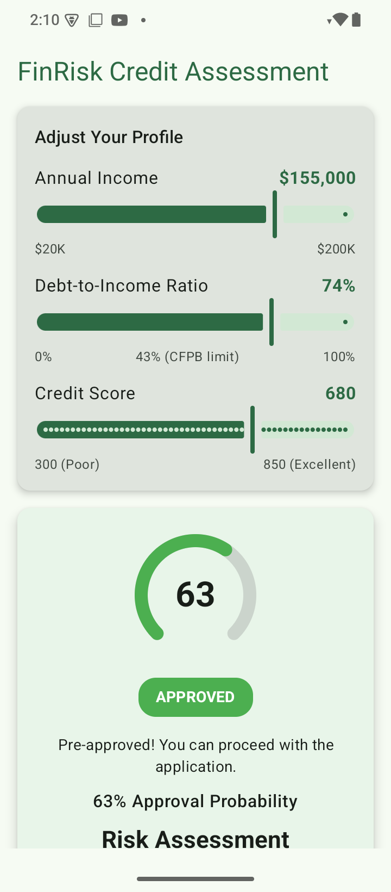
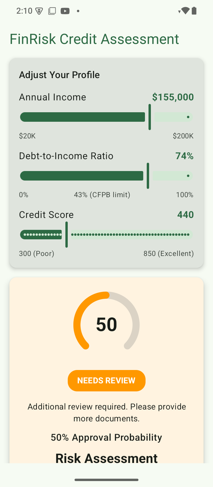
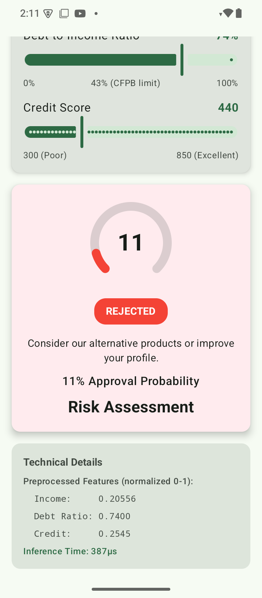

# Fin Credit Risk (FCR) - Credit Risk Assessment App

An Android application that uses on-device machine learning to assess credit risk in real-time. Built as the companion project for  — from theory to on-device inference.

## Features

- **Real-time ML Inference**: On-device TensorFlow Lite model for instant predictions
- **Interactive UI**: Sliders for income, debt ratio, and credit score
- **Visual Feedback**: Animated gauge and color-coded decision badges
- **Technical Transparency**: Shows preprocessed features and inference time
- **Offline Capable**: No network required — all inference runs locally
- **Production-Ready**: Kill switch, fallback classifier, crash reporting, and analytics infrastructure

## Screenshots

|                                                            Approved                                                             |                                                            Review                                                             |                        Rejected                         |
|:-------------------------------------------------------------------------------------------------------------------------------:|:-----------------------------------------------------------------------------------------------------------------------------:|:-------------------------------------------------------:|
|  |  |  |

## Recoding

**Screen Recording:**


[](https://youtube.com/shorts/_gjqSZ7Pvk4?feature=share)

## Architecture

The app follows **Clean Architecture** with clear separation of concerns:

```
┌─────────────────────────────────────────────────────────────┐
│  PRESENTATION LAYER                                         │
│  ├── ui/          Compose screens & components              │
│  └── viewmodel/   State management & UI logic               │
├─────────────────────────────────────────────────────────────┤
│  DOMAIN LAYER                                               │
│  ├── model/       Business entities (RiskResult, Decision)  │
│  └── classifier/  RiskClassifier interface                  │
├─────────────────────────────────────────────────────────────┤
│  DATA LAYER                                                 │
│  ├── ml/          LiteRtRiskClassifier (TFLite inference)   │
│  ├── ml/          FallbackRiskClassifier (safe default)     │
│  └── ml/          ModelState sealed class (Loading/Ready/   │
│                   Failed)                                   │
├─────────────────────────────────────────────────────────────┤
│  DI LAYER                                                   │
│  └── di/          Hilt modules (kill switch logic)          │
├─────────────────────────────────────────────────────────────┤
│  INFRASTRUCTURE                                             │
│  ├── logging/     CrashlyticsTree (Timber → crash reports)  │
│  └── analytics/   MlAnalytics (inference event tracking)    │
└─────────────────────────────────────────────────────────────┘
```

### Data Flow

```
User Input → ViewModel → Preprocessing → ML Inference → RiskResult → UI Update
```

1. User adjusts slider (income / debt ratio / credit score)
2. ViewModel normalizes inputs to 0-1 range
3. Normalized features sent to `RiskClassifier`
4. LiteRT runs inference on TFLite model
5. Result mapped to business decision (Approved / Review / Rejected)
6. UI recomposes with new state


## ML Model

### Model Details

| Property | Value |
|----------|-------|
| Framework | TensorFlow Lite (LiteRT) |
| Type | Logistic Regression |
| Input Shape | [1, 3] float32 |
| Output Shape | [1, 1] float32 |
| Size | ~1.8 KB |

### Input Features (normalized 0-1)

| Index | Feature | Raw Range | Normalization |
|-------|---------|-----------|---------------|
| 0 | Income | $20K - $200K | (x - 20000) / 180000 |
| 1 | Debt Ratio | 0% - 100% | Already 0-1 |
| 2 | Credit Score | 300 - 850 | (x - 300) / 550 |

### Decision Thresholds

| Probability | Decision |
|-------------|----------|
| >= 60% | APPROVED |
| >= 40% | REVIEW |
| < 40% | REJECTED |

## Production Features

### Kill Switch

`BuildConfig.ML_ENABLED` controls whether the real model or fallback is injected:

```kotlin
// MlModule.kt
if (BuildConfig.ML_ENABLED) LiteRtRiskClassifier(...) else FallbackRiskClassifier()
```

### Fallback Classifier

When ML is disabled or fails, `FallbackRiskClassifier` returns `REVIEW` (the safest default for a financial app) with probability 0.5.

### Model State Management

`ModelState` is a sealed class that makes illegal states unrepresentable:

- `Loading` — model being loaded from assets
- `Ready(interpreter)` — loaded and ready for inference
- `Failed(error)` — load failed, error preserved for crash reporting


